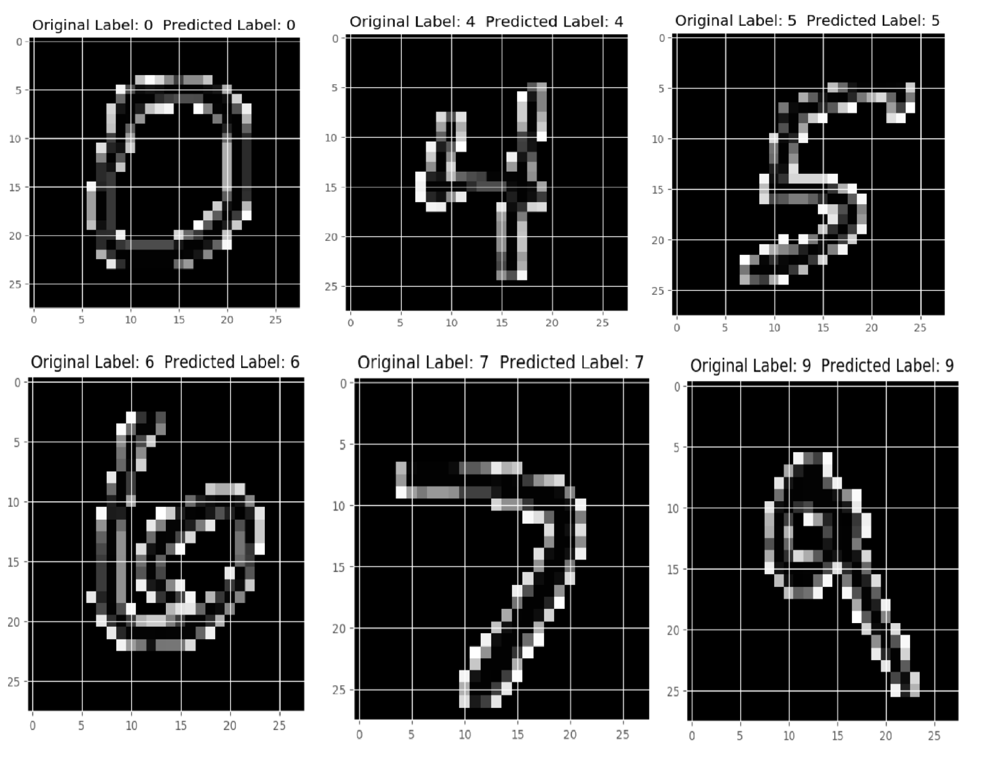

# Handwritten Digit Recognition using Machine Learning and Deep Learning

## Overview
This project is focused on recognizing handwritten digits using various machine learning and deep learning algorithms. The project includes implementations of K Nearest Neighbors (KNN), Support Vector Machine (SVM), Random Forest Classifier (RFC), and Convolutional Neural Networks (CNN).

## Requirements
- Python 3.5+
- Scikit-Learn (latest version)
- Numpy (+ mkl for Windows)
- Matplotlib

## Dataset Preparation
1. Download the MNIST dataset files:
   ```sh
   curl -O http://yann.lecun.com/exdb/mnist/train-images-idx3-ubyte.gz
   curl -O http://yann.lecun.com/exdb/mnist/train-labels-idx1-ubyte.gz
   curl -O http://yann.lecun.com/exdb/mnist/t10k-images-idx3-ubyte.gz
   curl -O http://yann.lecun.com/exdb/mnist/t10k-labels-idx1-ubyte.gz
   ```
   Alternatively, download and unzip the dataset from [here](https://github.com/anujdutt9/Handwritten-Digit-Recognition-using-Deep-Learning/blob/master/dataset.zip) and place the files in the respective folders.

2. Place the dataset files in the `MNIST_Dataset_Loader/dataset` directory under each algorithm folder (KNN, SVM, RFC).

## Running the Models
3. Navigate to the desired algorithm directory and run the corresponding Python script:
   ```sh
   cd 1. K Nearest Neighbors/
   python knn.py
   # or
   python3 knn.py
   ```
   This will log all print statements into the `summary.log` file. To print outputs to the command prompt, comment out lines 16, 17, 18, 106, and 107 in the script.

4. To run the CNN code, navigate to the `CNN_Keras` directory and run:
   ```sh
   python CNN_MNIST.py
   # or
   python3 CNN_MNIST.py
   ```

5. To save the CNN model weights after training:
   ```sh
   python CNN_MNIST.py --save_model 1 --save_weights cnn_weights.hdf5
   # or
   python3 CNN_MNIST.py --save_model 1 --save_weights cnn_weights.hdf5
   ```

6. To load the saved model weights and avoid retraining:
   ```sh
   python CNN_MNIST.py --load_model 1 --save_weights cnn_weights.hdf5
   # or
   python3 CNN_MNIST.py --load_model 1 --save_weights cnn_weights.hdf5
   ```

## Results
### Accuracy using Machine Learning Algorithms:
- **K Nearest Neighbors:** 96.67%
- **Support Vector Machine:** 97.91%
- **Random Forest Classifier:** 96.82%

### Accuracy using Deep Neural Networks:
- **Three Layer Convolutional Neural Network using Tensorflow:** 99.70%
- **Three Layer Convolutional Neural Network using Keras and Theano:** 98.75%

## Example Output
